## Go Fast Snippets
[](https://github.com/kauemurakami/go-snippets/blob/main/README.pt-br.md)
[](https://github.com/kauemurakami/go-snippets/blob/main/README.md)
[](https://github.com/kauemurakami/get_snippets_extension)

  

#### Extension for vscode with autocomplete snippets for GO codes.
*Speed ​​up* your development process with shortcuts that free you from rewriting routine code, such as functions, variables, structs, etc., see the available snippets:<br/>
Here are some examples of using code snippets. You can see the rest of the options below, in this README.<br/> 

### gomain
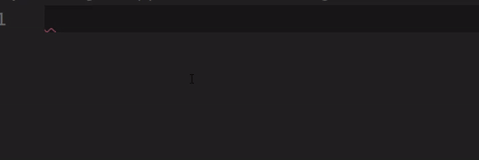  
When writing ```gomain``` in a file and selecting it for autocomplete it will generate the basic code of a file, for example, start by writing ```gomain```, or just ```go``` and you will see the full snippet options:   
```go
package main

func main() {
	
}
```

### goinit
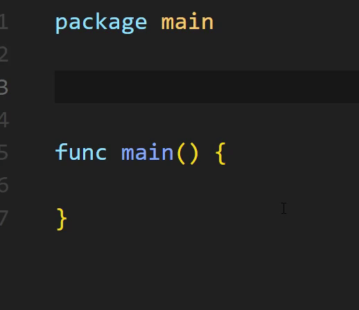  
Here, by typing ```goinit``` we create the ```init()``` function that starts before all the functions in the .go file, let's see:   
```go
func init() {
			
}
```
Aqui não precisamos definir nenhum parâmetro.<br/>

### gofile
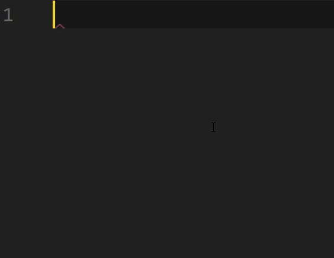   
When typing ```gofile``` in an empty file it generates the basic code of a ```.go``` file, with ```name``` pre-selected for change:  
```go
package name

func init() {
	
}

func main() {
	
}
```  
```gofile``` generates a code that is a little more complete than ```gomain```, also providing us with ```goinit``` <br/>

### gofunc
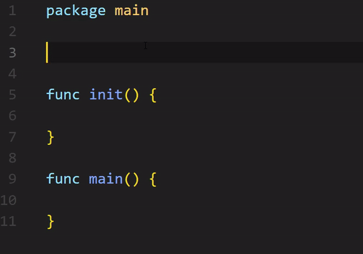  
When writing ```gofunc``` it will return us a function with autocompletes in the function name, parameter and return type, just switch with the TAB key after entering one by one, let's see what ```gofunc``` generates us:  
```go
//gofunc
func name(params type)  returnType {
  return params
}
```
Remembering that, initially ```name``` is the first attribute to be inserted, from a TAB and will jump to the ```params```, being able to insert one or more parameters separated by a comma, from another TAB and it will be in ```type``` which is the type of ```params``` in the last TAB it will define the return type ```returnType```, do the test.<br/>

### gofuncempty  
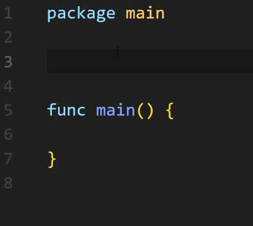  
Here you have the option of creating an empty function, without parameters and without returns, so when typing ```gofun``` it will appear, but in the case of an empty function we will use the command ```gofuncempty``` which gives us will generate:   
```go
func name() {
		
}
```
Always remember that ```name``` has already been selected for name change.<br/>

### gofuncerr
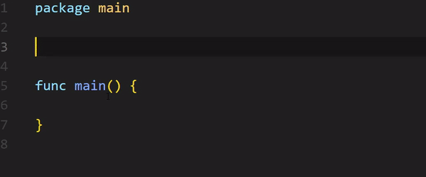  
A function that can receive an error and handle it, just start typing ```gofuncerr``` and we will have the following result:  
```go
func name(params) (returnType, error) {
	
}
```
With the same modus operandi as other snippets that have more than one value to be changed, this function also follows these patterns and can be switched using TAB when declaring a value and going to the next.<br/>

### gostruct
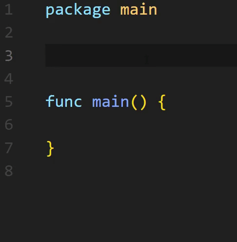  
Here, when typing ```gostruct``` you will create a model of a struct, let's see:  
```go
type name struct {
  varname type
}
```
Starting by defining ```name``` with a TAB we can define ```varname``` and with another TAB we define the ```type```<br/>

### gointerface  
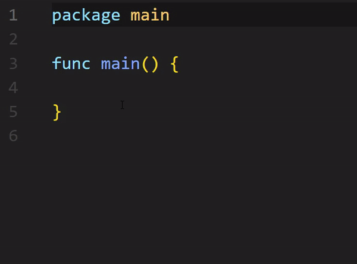  

Here, when we type ```gointerface``` it will give us a snippet of an interface: 
```go
type name interface {
  
}
```
Leaving the name pre-selected for change.<br/>

### gointerfacegeneric
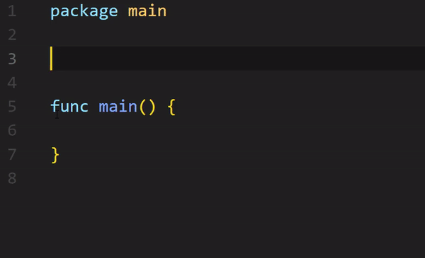  

Here, when we type ```gointer..``` it will show us the snippet we are looking for ```gointerfacegeneric```, when selecting it, it will generate the following code:   
```go
func name(nameinterface interface{}) {
  
}
```
As the first pre-selected attribute for renaming, ```name``` and with a TAB we also define ```nameinterface``` <br/>

### gomap
Creates a declaration of a map variable with key type and value type, in this case it is preselected for changing the ```varname```, ```keytype``` and ```valuetype```:  
```go
var varname map[keytype]valuetype
```  

### gomapvalues
With ```gomapvalues``` you will create a map by inference, already being able to assign values, let's see the code generated when using the snippet:  
```go
mapname := map[keytype]valuetype{
  "key1" : "Value1", 
  "key2" : "Value1", 
}
```
Following the same pattern in order, ```mapname``` is the first pre-selected, when navigating with TAB you go to ```keytpe``` -> ```valuetype``` -> ```key1 ``` -> ```value1``` and so on and you can change them effortlessly.<br/>


### govar  
Here, when we type ```govar``` and select auto complete, it creates a simple variable, receiving the type by inference, receiving a ```name``` and a ```type```, see:  
```go
name := val
```
Having the same feature of being self-selected to change the ```name``` and when TAB defining the ```val```.<br/>

### govartype
Here, when typing ```govar``` the option ```govartype``` will appear, unlike ```govar```, ```govartype``` creates a variable with a defined type, let's see:  
```go
var name type
```
Having the same behavior, where ```name``` is pre-selected for change and by giving a TAB you can change the ```type```.<br/>

### goif  
When we type ```goif``` and select auto complete, we will see the following simple code snippet:   
```go
if var operator val {

}
```
Where our ```var``` will be preselected, so that you can change it with the name of any variable or value you want to compare, the ```operator``` which can be >, ==, for example, and finally ` ``value``` the value we are using for comparison, all of which can be defined just with the keyboard using TAB to switch from one to another.<br/>

### gofor  
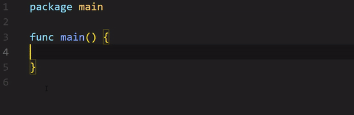  

When we type ```gofor``` it will create a simple for, with variable initialization inside it, let's see:  
```go
for var := initial-value; var operator value ; var factor {
 
}
```
Where var is initially pre-selected to be defined as you wish, for example ```k:= 0```, then when giving a TAB it will choose the ```initial value``` of ```var```, all ```var```, will be completed together with the first definition of ```var```, that is, if initially the first ```var``` is ```k```, all others ```var``` will also be, among this too, when giving a TAB, we must also define the operator to stop ```for```, == for example, then we define the ```factor``` which can be ```++``` ```--``` for example.<br/>

### goforrange   
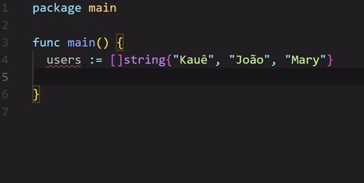  

Here we join our ```for``` with ```range``` to retrieve values, when typing ```goforrange``` it will generate this code snippet:  
```go
for index, obj := range array-or-slice {
				
}
```
Always remember that these defined "names" can be changed by navigating between them with TAB.<br/>


### goerr
With ```goerr``` we can treat the error with ```log.Fatal(err)``` in a simple if, or as you wish:  
```go
if err != nil {
  log.Fatal(err)
}
```
```log.Fatal()``` was used as an example, you could handle this error in different ways.<br/>

### goreadinput
Here we allow the user to enter data via terminal with ```goreadinput```, let's see the generated code snippet:   
```go
fmt.Print("Enter input: ")
var input type
fmt.Scanln(&input)
```
Here you must only change the type, after which you can receive a value that you enter via the terminal.
